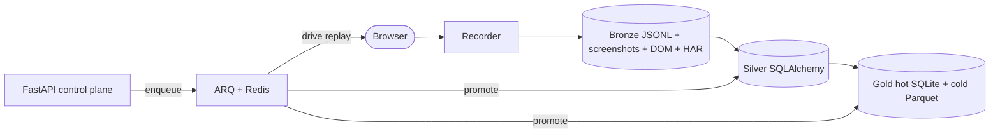

# rpa-recorder

> Semantic browser RPA with LLM-powered recovery.

<!-- Replace this line with `` once the demo recording is captured. -->
*A 30-second demo recording is on the way — see [CONTRIBUTING.md](CONTRIBUTING.md#adding-a-new-milestone) for the capture procedure.*

[](https://github.com/therealestmatthew/rpa-recorder/actions/workflows/ci.yml)
[](https://www.python.org/downloads/)
[](LICENSE)
[](https://github.com/astral-sh/ruff)
[](https://mypy-lang.org/)

## What it does

Records browser sessions with full semantic context, classifies each
action by intent (login, search, form-fill, navigation, ...), and replays
them resiliently. When selectors drift, the recovery engine tries
deterministic strategies first, then escalates to an LLM that proposes a
new selector — with operator-confirmable training data flowing into the
gold tier.

## Why it's different

- **Semantic replay.** Every captured action carries a classified
  `SemanticIntent`, not just a click coordinate.
- **LLM-powered recovery.** When `data-testid` and ARIA-role lookups
  fail, the recovery engine asks Claude for a new selector and verifies
  the result before committing.
- **Medallion data layout.** Bronze (raw artifacts) → Silver (validated
  rows) → Gold (analytics + training data) — built in, not bolted on.
  See [ADR-0001](.claude/plans/adr/0001-medallion-bronze-silver-gold-split.md).
- **Workers that scale.** ARQ + Redis split browser-heavy replays from
  IO-bound medallion promotion; FastAPI enqueues, never runs inline.

## Architecture preview



See [docs/architecture.md](docs/architecture.md) for the full layered
walk-through.

## Quickstart

```bash
# clone + install
git clone https://github.com/therealestmatthew/rpa-recorder.git
cd rpa-recorder
uv sync
uv run playwright install chromium

# (optional, production-mode) bring up Redis for the worker layer
docker compose up -d redis

# record a session against a public site
uv run rpa record demo --url https://example.com

# classify the captured actions
uv run rpa classify demo

# replay
uv run rpa replay demo
```

PowerShell variant — same commands, just `docker compose up -d redis`
runs identically. Optional control plane:

```bash
uv run rpa serve              # FastAPI on http://localhost:8000
uv run rpa worker --queue replay
uv run rpa worker --queue medallion
```

## Concepts

- **Recording** — a captured browser session. A `recordings` row + its
  `recorded_actions`, `network_events`, and bronze artifacts.
- **Action** — a single browser interaction (click, input, navigate)
  with an `ElementSelector` and a classified `SemanticIntent`.
- **SemanticIntent** — the classification output: `login`, `search`,
  `form_fill`, `form_submit`, `navigation`, `confirmation`,
  `dismiss_modal`, plus a confidence score.
- **RunResult** — the top-level row for a replay run, with per-action
  and per-attempt rows beneath it.

Full term list in [docs/glossary.md](docs/glossary.md).

## Configuration

Every runtime knob is an `RPA_*` environment variable mapped to a
`Config` field. Full reference: [docs/configuration.md](docs/configuration.md).

The minimum to run with the LLM tier:

```
RPA_ANTHROPIC_API_KEY=sk-ant-...
```

For production with Redis-backed workers:

```
RPA_QUEUE_BACKEND=arq
RPA_REDIS_URL=redis://localhost:6379/0
```

## Roadmap

13 of 14 milestones are complete; M14 (this documentation set) closes
the build out. The full milestone index lives in
[docs/build-plan.md](docs/build-plan.md). Future ideas — multi-tab
support, a browser-extension UI, visual-diff regression detection — are
parked there too.

## Contributing

Conventional Commits, ≥85% coverage on new code, ruff + mypy strict.
See [CONTRIBUTING.md](CONTRIBUTING.md).

Security findings via the process in [SECURITY.md](SECURITY.md), not
public issues.

## License

[MIT](LICENSE) © 2026 Matthew Mulé.
